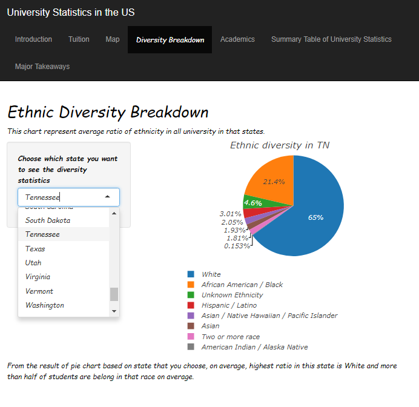
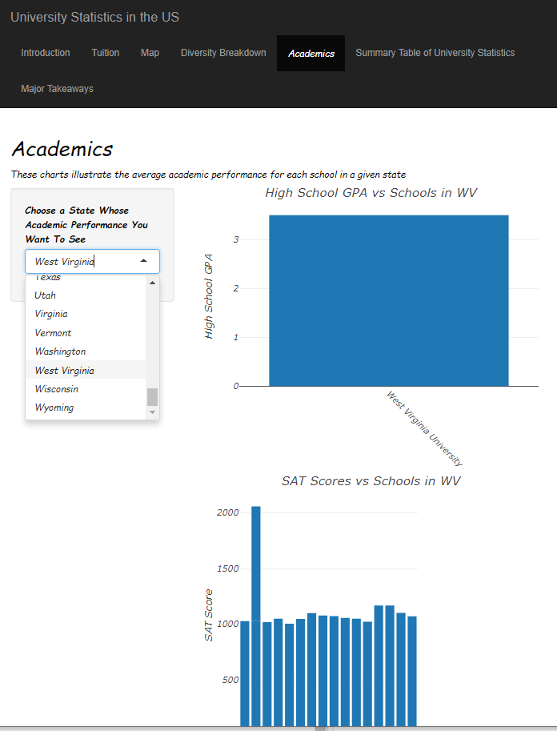

# University Data Advisory
Create a Web application using Rshiny to visualize data about college statistics. The app displays interactive visualizations based on acceptance rates, and college ranking based on department ranking, SAT scores, and GPA.

[Link to app](https://amaswa.shinyapps.io/final-project-amaswauw/)

Introduce the problem statement.

Create a summary of the most expensive colleges based on in-state and out-of-state tuition in each state. Use an interactive scatter plot to visualize the results.

Create a map showing the locations of universities in the United States.

Utilize a pie chart to understand diversity in universities in the US.

Use several bar charts to visualize college statistics (ranking, SAT/ACT, GPA) based on colleges in each state.

Portray data usage in a table format.

Summarize findings.

